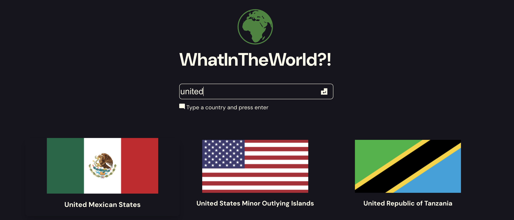

# WhatInTheWorld?!

Discover information about countries around the world with this simple React application. Search for a country, view its details, and explore its flag. Check out the live project [here](https://countries-react-app-41e6305a2b31.herokuapp.com/)!



## Features

- **Search for Countries**: Simply type the name of a country and press enter.
- **Country Details**: Click on a country card to view more detailed information about the country.
- **Responsive Design**: Works on both desktop and mobile devices.

## Setup

### From Git

1. **Clone the Repository**

```bash
git clone https://github.com/ConnaaaaR/countries-api-react.git
cd countries-api-react
```

2. **Install Dependencies**

```bash
npm install
```

3. **Setup Environment Variables**

Copy the `.env.template` file provided in the frontend directory. Rename the copy file to `.env` or use the bash command provided to copy the file. Make sure to set the `VITE_BACKEND_URL` variable to your backend server URL.

```bash
cp .env.example .env
```

4. **Run the Application**

```bash
npm start
```

### From a ZIP File

1. **Extract the ZIP File**

Unzip the downloaded file to a directory of your choice.

2. **Navigate to the Directory**

Open your terminal or command prompt and navigate to the directory.

```bash
cd <PATH TO EXTRACTED PROJECT>
```

3. **Install Dependencies**
```bash
npm install
```

4. **Setup Environment Variables**

Copy the `.env.template` file provided in the frontend directory. Rename the copy file to `.env` or use the bash command provided to copy the file. Make sure to set the `VITE_BACKEND_URL` variable to your backend server URL.
```bash
cp .env.example .env
```

5. **Run the Application**

```bash
npm start
```

## Using the `.env` File

The `.env` file contains the `VITE_BACKEND_URL`. This variable defines the server URL for the application. Without the correct setup of this variable the application will be unable to retrieve data from the API.


